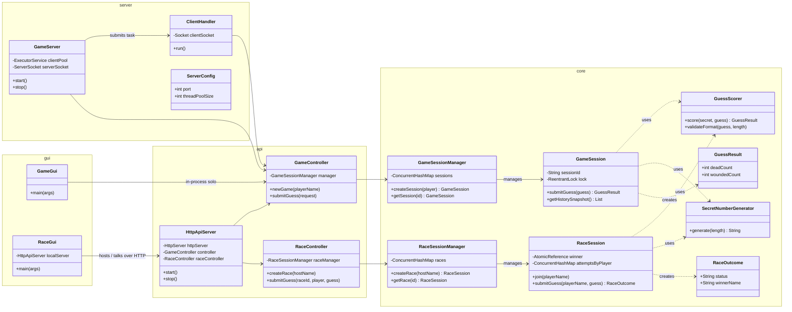

# Dead or Wounded — UML Class Diagram

Paste the Mermaid block below into **https://mermaid.live** to render and download as SVG or PNG.

```mermaid
classDiagram
    direction LR

    namespace core {
        class SecretNumberGenerator {
            +generate(length) String
        }
        class GuessScorer {
            +score(secret, guess) GuessResult
            +validateFormat(guess, length)
        }
        class GameSession {
            -String sessionId
            -ReentrantLock lock
            +submitGuess(guess) GuessResult
            +getHistorySnapshot() List
        }
        class GameSessionManager {
            -ConcurrentHashMap sessions
            +createSession(player) GameSession
            +getSession(id) GameSession
        }
        class RaceSession {
            -AtomicReference winner
            -ConcurrentHashMap attemptsByPlayer
            +join(playerName)
            +submitGuess(playerName, guess) RaceOutcome
        }
        class RaceSessionManager {
            -ConcurrentHashMap races
            +createRace(hostName) RaceSession
            +getRace(id) RaceSession
        }
        class GuessResult {
            +int deadCount
            +int woundedCount
        }
        class RaceOutcome {
            +String status
            +String winnerName
        }
    }

    namespace server {
        class GameServer {
            -ExecutorService clientPool
            -ServerSocket serverSocket
            +start()
            +stop()
        }
        class ClientHandler {
            -Socket clientSocket
            +run()
        }
        class ServerConfig {
            +int port
            +int threadPoolSize
        }
    }

    namespace api {
        class HttpApiServer {
            -HttpServer httpServer
            -GameController controller
            -RaceController raceController
            +start()
            +stop()
        }
        class GameController {
            -GameSessionManager manager
            +newGame(playerName)
            +submitGuess(request)
        }
        class RaceController {
            -RaceSessionManager raceManager
            +createRace(hostName)
            +submitGuess(raceId, player, guess)
        }
    }

    namespace gui {
        class GameGui {
            +main(args)
        }
        class RaceGui {
            -HttpApiServer localServer
            +main(args)
        }
    }

    %% Relationships
    GameServer --> ClientHandler : submits task
    GameServer --> GameController
    ClientHandler --> GameController
    HttpApiServer --> GameController
    HttpApiServer --> RaceController

    GameController --> GameSessionManager
    RaceController --> RaceSessionManager
    GameSessionManager --> GameSession : manages
    RaceSessionManager --> RaceSession : manages

    GameSession ..> GuessScorer : uses
    RaceSession ..> GuessScorer : uses
    GameSession ..> SecretNumberGenerator : uses
    RaceSession ..> SecretNumberGenerator : uses
    GameSession ..> GuessResult : creates
    RaceSession ..> RaceOutcome : creates

    GameGui --> GameController : in-process solo
    RaceGui --> HttpApiServer : hosts / talks over HTTP
```
